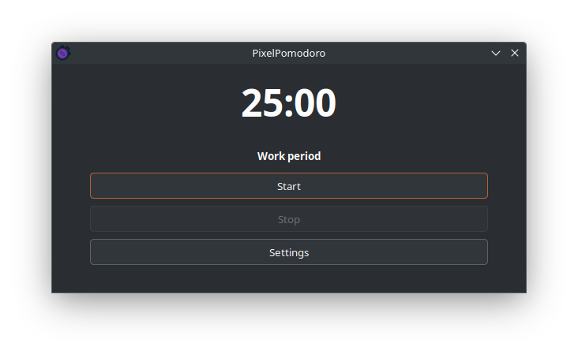
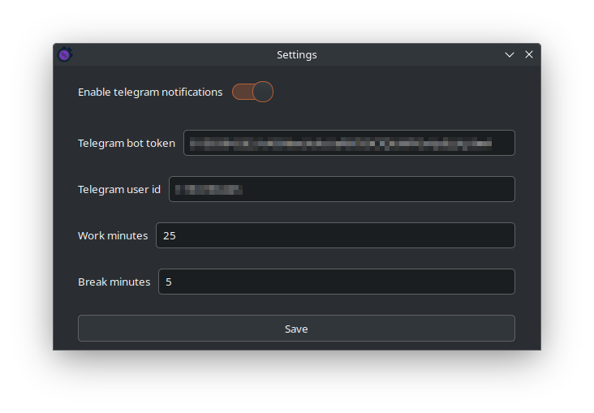

# PixelPomodoro

## Screenshots

## Installation
#### 1. Install dotnet 8.0.
> #### https://learn.microsoft.com/en-us/dotnet/core/install/linux?WT.mc_id=dotnet-35129-website
#### 2. Run PixelPomodoro. OR run this command in terminal from app folder: <code>./PixelPomodoro</code>

## Building from source
### Dependencies:
> #### GtkSharp  3.24.24.117-develop
> #### Telegram.Bot 22.3.0

#### 1. Open .sln file in IDE
#### 2. Install dependencies
#### 3. Run project building